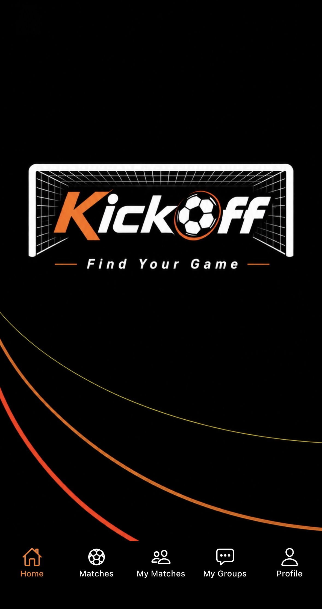
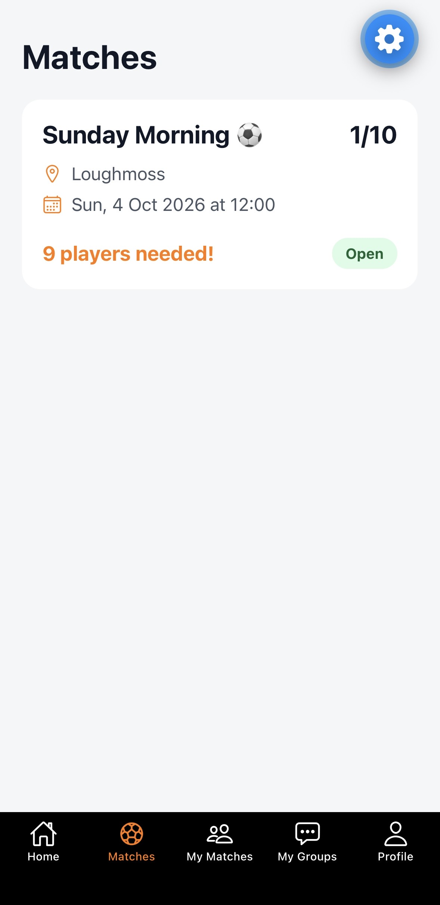
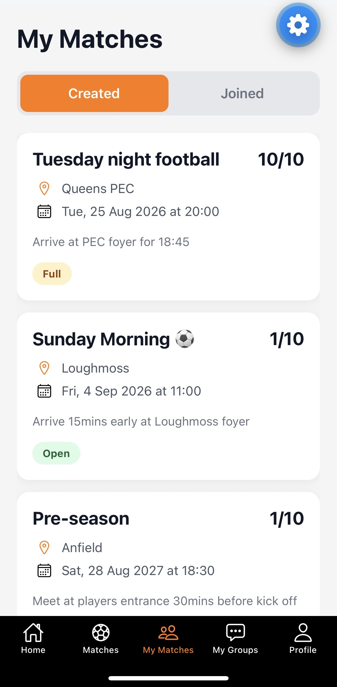
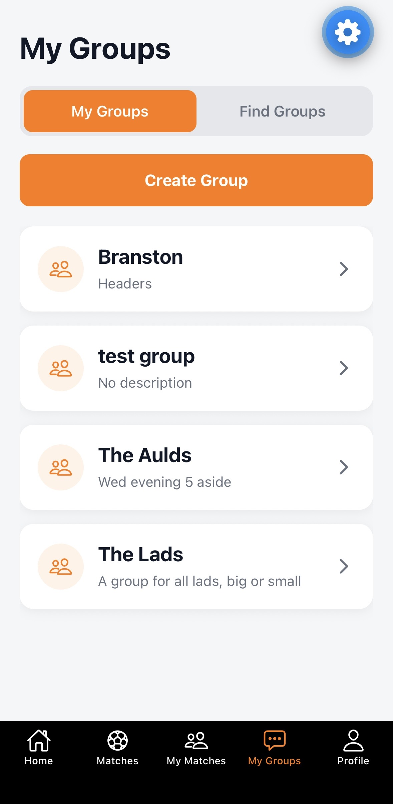
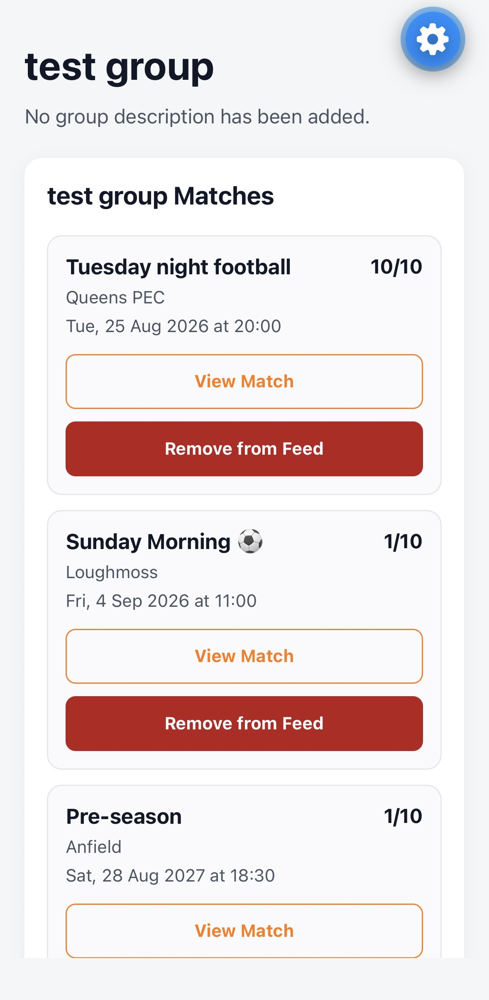
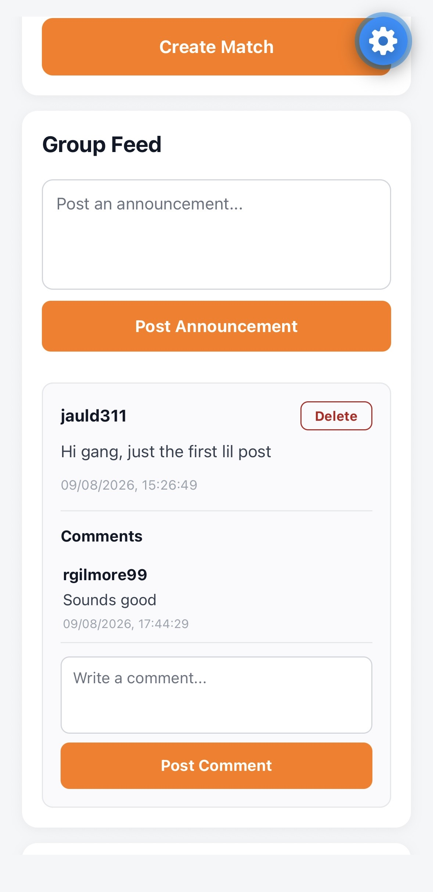
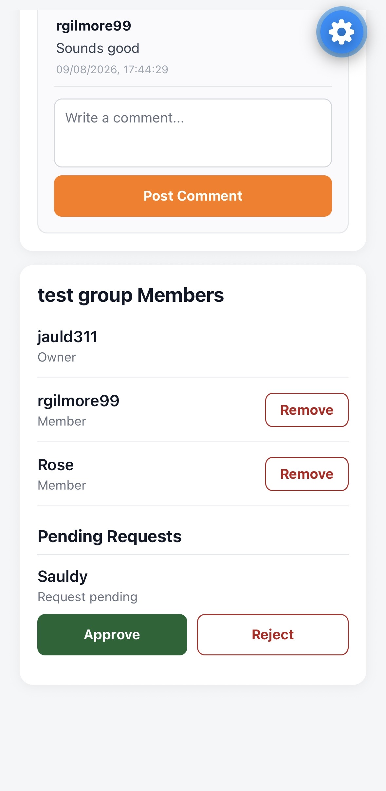

# ⚽ KickOff

KickOff is a mobile application designed to make organising casual 5-a-side football easier.

The application was developed as my MSc final project at Ulster University. It provides players and organisers with a central place to create matches, find games, manage groups and keep track of player availability, rather than relying on separate messaging apps and manual organisation.

## 📱 Features

### Match Management
- Create football matches with a date, location and maximum player capacity
- Edit, cancel and delete matches
- Join and leave available matches
- View matches you have created or joined
- Track the number of players attending a match
- Automatically identify full matches and remaining player spaces
- Choose whether a match is advertised on the public match feed

### Groups
- Create and manage football groups
- Browse available groups
- Request to join a group
- Approve or reject membership requests as a group administrator
- View group members
- Remove members from a group
- Leave groups
- View matches associated with a group

### Group Communication
- Create posts within groups
- Comment on group posts
- Delete posts and comments where permitted

### Accounts & Security
- Email and password authentication using Supabase Auth
- Persistent user sessions
- Protected application routes
- Individual user profiles
- Supabase Row Level Security (RLS) policies for database access

## 🛠️ Technologies

| Technology | Purpose |
| --- | --- |
| React Native | Mobile application development |
| TypeScript | Application programming language |
| Expo | Development and build platform |
| Expo Router | File-based navigation and routing |
| Supabase | Backend, PostgreSQL database and authentication |
| AsyncStorage | Persistent authentication storage |
| Jest | Automated testing |
| React Native Testing Library | Component and interaction testing |

## 🏗️ Project Structure

```text
KickOff/
├── app/            # Application screens and Expo Router routes
├── components/     # Reusable UI components
├── contexts/       # Authentication context
├── hooks/          # Custom React hooks
├── lib/            # Supabase client configuration
├── services/       # Database and application services
├── types/          # TypeScript type definitions
├── utils/          # Match utility functions
├── _tests_/        # Automated tests
└── supabase/       # Database migrations and RLS policies
```

The application separates UI, data access, authentication, types and utility logic to keep the codebase organised and maintainable.

## 🧪 Testing

KickOff includes automated tests using Jest and React Native Testing Library.

The test suite covers areas including:

- Match services
- Match details
- Match utility functions
- Group services
- Group posts
- Group details

Run the test suite with:

```bash
npm test
```

## 🔐 Backend & Security

KickOff uses Supabase for its backend services.

Authentication is handled through Supabase Auth, while PostgreSQL stores application data such as users, matches, participants, groups and posts.

Row Level Security policies are used to restrict database operations. For example, users can only modify matches they created and can only join or leave matches as themselves.

Environment variables are used to keep project configuration separate from the source code.

## 🚀 Running the Project

### Prerequisites

You will need:

- Node.js
- npm
- Expo Go or an Android/iOS emulator
- A Supabase project

### Installation

Clone the repository:

```bash
git clone https://github.com/jauld311/KickOff.git
cd KickOff
```

Install the dependencies:

```bash
npm install
```

Create a `.env` file in the root directory and provide your Supabase configuration:

```env
EXPO_PUBLIC_SUPABASE_URL=your_supabase_url
EXPO_PUBLIC_SUPABASE_PUBLISHABLE_KEY=your_supabase_publishable_key
```

Start the application:

```bash
npx expo start
```

The application can then be opened using Expo Go or an appropriate emulator.

## 📸 Screenshots

<p align="center">
  
  
  
</p>

<p align="center">
  
  
  
  
</p>

## 🎓 Project Background

KickOff was developed as the final project for my MSc at Ulster University.

The project was created to explore how a dedicated mobile application could simplify the organisation of recreational football. Casual groups commonly need to coordinate player availability, match information, group membership and communication, which can otherwise become fragmented across different platforms.

The project involved requirements gathering, application design, mobile development, backend/database development, authentication, security, testing and evaluation.

## 👤 Author

**Jack Auld**

MSc graduate, Ulster University

GitHub: [jauld311](https://github.com/jauld311)
